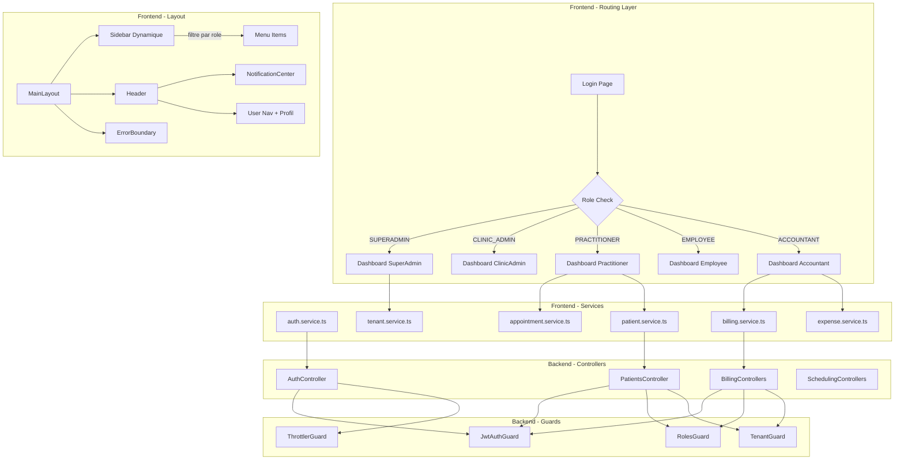

# Clinoo+ Brownfield Enhancement Architecture

## 1. Introduction

Ce document definit l'approche architecturale pour la refonte structurelle de Clinoo+. Il sert de blueprint technique pour le developpement des 3 epics (16 stories) definis dans le PRD, en garantissant l'integration harmonieuse avec le systeme existant.

**Relation avec l'architecture existante :** Ce document complete l'architecture NestJS modulaire deja en place. Aucun changement de paradigme — on corrige, harmonise et enrichit. Les patterns existants (service layer, JWT auth, TypeORM entities, shadcn/ui components) sont conserves.

### Existing Project Analysis

#### Current Project State

- **Primary Purpose :** Plateforme SaaS multi-tenant de gestion de cliniques medicales au Niger
- **Current Tech Stack :** Next.js 16 + NestJS + Flutter + TypeORM/MySQL + JWT + Socket.io
- **Architecture Style :** Monolithe modulaire NestJS (8 modules domain-driven), SPA client-side Next.js, mobile offline-first Flutter
- **Deployment Method :** PM2 sur VPS, Docker pour les services (PostgreSQL/MySQL, RabbitMQ, MinIO)

#### Available Documentation

- CLAUDE.md (frontend et backend) — conventions et structure du projet
- docs/brief.md — brief du projet valide
- docs/prd.md — PRD brownfield avec 25 FR, 6 NFR, 4 CR, 16 stories

#### Identified Constraints

- Base de donnees MySQL en production (pas PostgreSQL) — les types enum MySQL ont des contraintes specifiques
- Export statique Next.js (`output: 'export'` dans certaines configs) — pas de SSR, tout client-side
- Tokens en `localStorage` (pas cookies) — le middleware Next.js ne peut pas lire les tokens, la protection de route est hybride (middleware leger + composant useAuth)
- Flutter Android seulement — pas de build iOS pour le moment
- Developpeur seul + Claude Code — pas d'equipe QA, tests manuels principalement
- `synchronize: true` en dev — pas de systeme de migrations formelles en production

### Change Log

| Change | Date | Version | Description | Author |
|--------|------|---------|-------------|--------|
| Creation initiale | 2026-04-11 | 1.0 | Architecture brownfield basee sur PRD v1.0 | Winston (Architect) |

---

## 2. Enhancement Scope and Integration Strategy

### Enhancement Overview

**Enhancement Type :** Major Feature Modification + UI/UX Overhaul + Bug Fix + New Features
**Scope :** Systeme de roles (5 roles), interfaces dediees par role, securite, nettoyage du code, fonctionnalites complementaires
**Integration Impact :** Significant — touche le backend (enum, guards, controllers), le frontend (types, sidebar, dashboards, middleware, services), et le mobile (modeles auth)

### Integration Approach

**Code Integration Strategy :**
Le code existant est modifie in-place, pas de branches architecturales paralleles. Les modifications suivent l'ordre : backend d'abord (enum + guards + controllers), puis frontend (types + sidebar + dashboards), puis mobile (modeles). Chaque story est un increment deploable independamment.

**Database Integration :**
Modification additive uniquement. L'enum `AuthUserRole` dans MySQL sera etendu avec `ACCOUNTANT`. TypeORM `synchronize: true` gere cela en dev. En production, un `ALTER TABLE` sera necessaire :
```sql
ALTER TABLE users MODIFY COLUMN role ENUM('SUPERADMIN','CLINIC_ADMIN','EMPLOYEE','PRACTITIONER','ACCOUNTANT') DEFAULT 'EMPLOYEE';
```
Aucune nouvelle table n'est requise pour les 3 epics.

**API Integration :**
- Endpoints existants : signatures inchangees, ajout de `ACCOUNTANT` dans les `@Roles()` decorators
- Nouveaux endpoints (3 seulement) :
  - `PATCH /auth/profile` — mise a jour profil
  - `POST /auth/change-password` — changement mot de passe
  - `GET /patients/check-duplicate` — detection doublons
- Pas de breaking changes sur les contrats API existants

**UI Integration :**
- Modification de la sidebar existante (filtrage par role)
- Modification des dashboards existants (donnees API au lieu de hardcode)
- Nouveaux composants integres dans le layout existant (`MainLayout`)
- Utilisation exclusive de shadcn/ui, Tailwind brand colors, Lucide icons

### Compatibility Requirements

- **Existing API Compatibility :** Tous les endpoints REST conservent URL, methode HTTP et format de reponse. L'app mobile ne doit pas etre impactee par les changements backend (CR1).
- **Database Schema Compatibility :** Ajout additif uniquement. Pas de DROP, RENAME, ou modification destructive (CR2).
- **UI/UX Consistency :** Composants shadcn/ui, couleurs brand (`brand-blue`, `brand-cyan`, `brand-green`, `brand-teal`), patterns de layout identiques (CR3).
- **Performance Impact :** Les ajouts de filtrage `tenantId` sur les `findOne()` ajoutent un WHERE indexe — impact negligeable (<1ms).

---

## 3. Tech Stack

### Existing Technology Stack

| Category | Current Technology | Version | Usage in Enhancement | Notes |
|----------|-------------------|---------|---------------------|-------|
| Frontend Framework | Next.js | 16.1.6 | Dashboards, sidebar, middleware, profil | App Router, client-side only |
| Frontend UI | shadcn/ui + Tailwind CSS | 3.3.3 | Tous les nouveaux composants | Pattern existant conserve |
| Frontend State | React hooks (useAuth, useState) | 18.3.1 | Filtrage par role, redirection | Pas de Redux/Zustand |
| Frontend Forms | React Hook Form + Zod | - | Page profil, formulaires | Pattern existant |
| Backend Framework | NestJS | - | Controllers, guards, services, DTOs | Monolithe modulaire |
| Backend ORM | TypeORM | - | Entities, queries, relations | synchronize: true en dev |
| Database | MySQL | 8.x | Extension enum AuthUserRole | Production |
| Auth | Passport JWT + bcrypt | - | Guards, strategies, rate limiting | Dual auth (user + practitioner) |
| Mobile | Flutter + Riverpod + Drift | 3.x | Modeles auth, enum roles | Offline-first |
| Real-time | Socket.io | - | File d'attente (non impacte) | Pas de changement |
| Object Storage | MinIO | - | PDFs (non impacte) | Pas de changement |
| Message Queue | RabbitMQ | - | Events (non impacte) | Pas de changement |

### New Technology Additions

| Technology | Version | Purpose | Rationale | Integration Method |
|-----------|---------|---------|-----------|-------------------|
| @nestjs/throttler | ^5.x | Rate limiting sur endpoints auth | FR15 — protection brute force, solution officielle NestJS | `npm install`, configuration dans `app.module.ts` via `ThrottlerModule.forRoot()` |

Aucune autre nouvelle technologie n'est requise. Tout le reste utilise les stacks existants.

---

## 4. Data Models and Schema Changes

### Modifications de modeles existants

#### User Entity (modification)

**Purpose :** Ajout de la valeur `ACCOUNTANT` a l'enum `AuthUserRole`
**Integration :** Modification in-place de l'enum existant dans `auth/entities/user.entity.ts`

**Changement :**
```typescript
export enum AuthUserRole {
  SUPERADMIN = 'SUPERADMIN',
  CLINIC_ADMIN = 'CLINIC_ADMIN',
  EMPLOYEE = 'EMPLOYEE',
  PRACTITIONER = 'PRACTITIONER',
  ACCOUNTANT = 'ACCOUNTANT',  // NOUVEAU
}
```

**Relationships :** Aucun changement — User garde ses relations existantes (Tenant, Sessions).

### Nouveaux modeles

Aucun nouveau modele/entite n'est requis pour les 3 epics. Les 16 stories operent sur les entites existantes avec des modifications de logique metier, pas de schema.

### Schema Integration Strategy

**Database Changes Required :**
- **New Tables :** Aucune
- **Modified Tables :** `users` (extension enum `role`)
- **New Indexes :** Aucun requis (les indexes existants couvrent les requetes)
- **Migration Strategy :** `synchronize: true` en dev. En production : `ALTER TABLE users MODIFY COLUMN role ENUM(...)` avant deploiement.

**Backward Compatibility :**
- Les utilisateurs existants conservent leurs roles actuels sans changement
- L'ajout d'une valeur a un enum MySQL est une operation non-destructive
- Les tokens JWT existants restent valides (le role est lu depuis la DB, pas encode dans le token)

---

## 5. Component Architecture

### Nouveaux composants Frontend

#### RoleBasedRedirect

**Responsibility :** Rediriger automatiquement les utilisateurs vers leur dashboard selon leur role apres login
**Integration Points :** `app/dashboard/page.tsx`, `hooks/useAuth.ts`

**Key Interfaces :**
- Input : `user.role` depuis `useAuth()`
- Output : `router.push()` vers le dashboard correspondant

**Dependencies :**
- Existing : `useAuth`, `useRouter`
- New : Aucun

**Technology Stack :** React component ('use client')

#### DashboardSuperAdmin

**Responsibility :** Afficher les stats systeme (tenants, users, cliniques) pour le SUPERADMIN
**Integration Points :** `app/admin/dashboard/page.tsx`, `services/tenant.service.ts`

**Key Interfaces :**
- Input : `TenantService.getTenants()`, `TenantService.getUsers()`
- Output : Stat cards, liste tenants, actions rapides

**Dependencies :**
- Existing : `TenantService`, shadcn/ui components, `useAuth`
- New : Aucun

#### DashboardAccountant

**Responsibility :** Afficher les stats financieres pour le ACCOUNTANT
**Integration Points :** `app/accounting/dashboard/page.tsx`, `services/billing.service.ts`, `services/expense.service.ts`

**Key Interfaces :**
- Input : `BillingService.getInvoices()`, `BillingService.getPayments()`, `ExpenseService.getExpenses()`, `ExpenseService.getStats()`
- Output : Stat cards (revenus, depenses, factures), widgets financiers

**Dependencies :**
- Existing : `BillingService`, `ExpenseService`, shadcn/ui components
- New : Aucun

#### NotificationCenter

**Responsibility :** Afficher les notifications in-app dans le header
**Integration Points :** `components/layout/header.tsx`

**Key Interfaces :**
- Input : Donnees des services existants (appointments, invoices, queue)
- Output : Dropdown avec liste de notifications, badge compteur

**Dependencies :**
- Existing : `AppointmentService`, `BillingService`, Lucide icons
- New : Aucun

#### ErrorBoundary

**Responsibility :** Capturer les erreurs React non gerees et afficher une page d'erreur en francais
**Integration Points :** `components/layout/main-layout.tsx`

**Key Interfaces :**
- Input : Erreur React (componentDidCatch)
- Output : Page d'erreur avec boutons recharger/retour dashboard

**Dependencies :**
- Existing : shadcn/ui (Card, Button)
- New : Aucun

#### ProfilePage

**Responsibility :** Permettre a l'utilisateur de modifier son profil et changer son mot de passe
**Integration Points :** `app/profile/page.tsx`, backend `AuthController`

**Key Interfaces :**
- Input : `AuthService.getCurrentUser()`, `apiClient.patch('/auth/profile')`, `apiClient.post('/auth/change-password')`
- Output : Formulaire profil, formulaire mot de passe

**Dependencies :**
- Existing : `useAuth`, `apiClient`, React Hook Form, Zod, shadcn/ui Form
- New : Endpoints backend `PATCH /auth/profile`, `POST /auth/change-password`

### Component Interaction Diagram



---

## 6. API Design and Integration

### API Integration Strategy

**Strategy :** Extension additive — les endpoints existants conservent leur signature, on ajoute des roles aux decorators et on cree 3 nouveaux endpoints.
**Authentication :** JWT Bearer token via `JwtAuthGuard` (global APP_GUARD). Rate limiting ajoute via `ThrottlerGuard`.
**Versioning :** Pas de versioning pour ce MVP. Tous les changements sont retro-compatibles.

### New API Endpoints

#### PATCH /auth/profile

- **Method :** PATCH
- **Endpoint :** `/auth/profile`
- **Purpose :** Mettre a jour le profil de l'utilisateur connecte (prenom, nom, email)
- **Integration :** Ajoute au `AuthController` existant, protege par `JwtAuthGuard`

**Request :**
```json
{
  "firstName": "string (optional)",
  "lastName": "string (optional)",
  "email": "string (optional, email format)"
}
```

**Response :**
```json
{
  "id": "uuid",
  "email": "string",
  "firstName": "string",
  "lastName": "string",
  "role": "SUPERADMIN|CLINIC_ADMIN|EMPLOYEE|PRACTITIONER|ACCOUNTANT",
  "tenantId": "uuid|null",
  "isActive": true
}
```

#### POST /auth/change-password

- **Method :** POST
- **Endpoint :** `/auth/change-password`
- **Purpose :** Changer le mot de passe de l'utilisateur connecte
- **Integration :** Ajoute au `AuthController` existant, protege par `JwtAuthGuard`

**Request :**
```json
{
  "currentPassword": "string (min 8 chars)",
  "newPassword": "string (min 8 chars)",
  "confirmPassword": "string (must match newPassword)"
}
```

**Response :**
```json
{
  "message": "Mot de passe modifie avec succes"
}
```

#### GET /patients/check-duplicate

- **Method :** GET
- **Endpoint :** `/patients/check-duplicate`
- **Purpose :** Verifier l'existence de doublons potentiels avant creation d'un patient
- **Integration :** Ajoute au `PatientsController` existant, protege par `JwtAuthGuard` + `RolesGuard` + `TenantGuard`

**Request :**
```
GET /patients/check-duplicate?firstName=Jean&lastName=Dupont&dob=1990-05-15
```

**Response :**
```json
{
  "duplicates": [
    {
      "id": "uuid",
      "firstName": "Jean",
      "lastName": "Dupont",
      "dob": "1990-05-15",
      "mrn": "MRN-001",
      "phone": "+227..."
    }
  ],
  "hasDuplicates": true
}
```

### Endpoints modifies (ajout role ACCOUNTANT)

Les endpoints suivants ajoutent `AuthUserRole.ACCOUNTANT` a leur `@Roles()` :

| Controller | Endpoints | Acces ACCOUNTANT |
|-----------|-----------|-----------------|
| InvoicesController | GET, POST, PATCH, POST send, POST mark-paid, GET download | Lecture + ecriture |
| PaymentsController | GET, POST, PATCH | Lecture + ecriture |
| ExpensesController | GET, POST, PATCH, GET stats | Lecture + ecriture |
| TariffsController | GET, GET by category, GET by id | Lecture seule |

---

## 7. Source Tree

### Existing Project Structure (parties pertinentes)

```
medical/
├── app/
│   ├── admin/
│   │   ├── tenants/page.tsx
│   │   ├── users/page.tsx
│   │   └── permissions/page.tsx
│   ├── accounting/
│   │   ├── dashboard/page.tsx
│   │   ├── invoices/
│   │   ├── payments/
│   │   ├── expenses/page.tsx
│   │   └── tariffs/page.tsx
│   ├── appointments/
│   ├── auth/login/page.tsx
│   ├── dashboard/page.tsx
│   ├── encounters/
│   ├── patients/
│   ├── practitioner/dashboard/page.tsx
│   └── queue/
├── components/
│   ├── layout/
│   │   ├── main-layout.tsx
│   │   ├── sidebar.tsx
│   │   ├── header.tsx
│   │   └── user-nav.tsx
│   └── ui/ (shadcn)
├── hooks/
│   ├── useAuth.ts
│   └── useTokenRefresh.ts
├── services/
│   ├── auth.service.ts         ← CONSERVER
│   ├── auth-service.ts         ← SUPPRIMER
│   ├── appointment.service.ts  ← CONSERVER
│   ├── appointment-service.ts  ← SUPPRIMER
│   ├── api-service.ts          ← SUPPRIMER
│   ├── patient.service.ts      ← MIGRER vers apiClient
│   ├── billing.service.ts
│   ├── expense.service.ts
│   ├── tenant.service.ts
│   └── dashboard-service.ts
├── types/
│   └── index.ts
├── lib/
│   ├── api.ts
│   └── utils.ts
├── middleware.ts
└── medicalBackend/
    └── src/
        ├── auth/
        │   ├── entities/user.entity.ts     ← MODIFIER (enum)
        │   ├── controllers/
        │   └── services/auth.service.ts
        ├── billing/
        │   └── controllers/                ← MODIFIER (@Roles)
        ├── common/
        │   └── guards/
        │       ├── tenant.guard.ts         ← CORRIGER (isAdmin)
        │       └── roles.guard.ts
        ├── ehr/
        │   └── services/                   ← CORRIGER (findOne tenantId)
        ├── patients/
        │   └── controllers/                ← AJOUTER check-duplicate
        ├── scheduling/
        └── main.ts                         ← MODIFIER (CORS, throttler)
```

### New File Organization

```
medical/
├── app/
│   ├── admin/
│   │   └── dashboard/page.tsx              # NOUVEAU — Dashboard SUPERADMIN
│   └── profile/page.tsx                    # NOUVEAU — Page profil utilisateur
├── components/
│   ├── layout/
│   │   └── error-boundary.tsx              # NOUVEAU — Error Boundary React
│   └── notifications/
│       └── notification-center.tsx         # NOUVEAU — Centre de notifications
└── medicalBackend/
    └── src/
        ├── auth/
        │   └── dto/
        │       ├── update-profile.dto.ts   # NOUVEAU — DTO profil
        │       └── change-password.dto.ts  # NOUVEAU — DTO mot de passe
        └── patients/
            └── dto/
                └── check-duplicate.dto.ts  # NOUVEAU — DTO doublons
```

### Integration Guidelines

- **File Naming :** kebab-case pour les fichiers (`notification-center.tsx`), PascalCase pour les composants React, camelCase pour les fonctions
- **Folder Organization :** Les nouveaux fichiers sont places dans les dossiers existants correspondants (pas de nouveau dossier sauf `components/notifications/`)
- **Import/Export Patterns :** Imports avec alias `@/` (ex: `import { useAuth } from '@/hooks/useAuth'`). Services exportes comme classes statiques ou singletons selon le pattern existant.

---

## 8. Infrastructure and Deployment Integration

### Existing Infrastructure

**Current Deployment :** PM2 sur VPS (frontend Next.js + backend NestJS comme processus separes)
**Infrastructure Tools :** Docker Compose (MySQL, RabbitMQ, MinIO), PM2 (process management)
**Environments :** Dev (local), Production (VPS avec PM2)

### Enhancement Deployment Strategy

**Deployment Approach :** Deploiement standard sans downtime. Les changements sont retro-compatibles.

Sequence de deploiement recommandee :
1. Deployer le backend modifie (enum + guards + nouveaux endpoints)
2. Executer le `ALTER TABLE` sur MySQL si `synchronize` ne le gere pas
3. Deployer le frontend modifie (types + sidebar + dashboards)
4. Mettre a jour l'app mobile Flutter (enum roles)
5. Publier la nouvelle version APK

**Infrastructure Changes :**
- Installation de `@nestjs/throttler` — aucune infra supplementaire requise
- Ajout de `CORS_ORIGINS` dans les variables d'environnement du serveur
- Deplacement des secrets JWT dans les variables d'environnement serveur (hors `.env` commite)
- Creation d'un fichier `.env.example` pour documenter les variables requises

**Pipeline Integration :** Pas de CI/CD formel pour le moment. Build et deploiement manuels via `npm run build` + PM2 restart.

### Rollback Strategy

**Rollback Method :**
- Git revert du commit si probleme detecte
- L'ajout de `ACCOUNTANT` a l'enum MySQL est non-destructif — pas besoin de rollback DB
- Les endpoints existants ne sont pas modifies dans leur signature — pas de breaking change

**Risk Mitigation :**
- Deployer Epic 1 (backend) d'abord et verifier avant de deployer Epic 2 (frontend)
- Garder une copie du `.env` original avant modification
- Tester chaque role manuellement apres deploiement

**Monitoring :**
- Verifier les logs PM2 pour les erreurs 500
- Tester le login avec chaque role apres deploiement
- Verifier l'isolation tenant avec un test croise (user tenant A essaie d'acceder aux donnees tenant B)

---

## 9. Coding Standards

### Existing Standards Compliance

**Code Style :**
- TypeScript strict (frontend + backend)
- `'use client'` directive sur tous les composants React interactifs
- Pattern `mounted` pour eviter les mismatches d'hydratation SSR/CSR
- Classes statiques pour les services frontend (`AuthService.login()`)
- Singletons pour certains services (`dashboardService`)
- `@Injectable()` + dependency injection pour les services backend

**Linting Rules :**
- ESLint configure mais `ignoreDuringBuilds: true` en frontend (a corriger en Phase 2)
- Prettier pour le backend (`npm run format`)

**Testing Patterns :**
- Jest + ts-jest pour le backend
- Tests unitaires avec repositories mockes
- E2E tests avec SQLite in-memory
- Pas de framework de test frontend installe

**Documentation Style :**
- Commentaires uniquement quand la logique est non-evidente
- Pas de JSDoc systematique
- CLAUDE.md comme documentation principale

### Enhancement-Specific Standards

- **Pas de `any`** : Tout nouveau code utilise des types stricts. Pas d'exception.
- **Pas de `console.log`** : Utiliser `if (process.env.NODE_ENV === 'development')` pour les logs de dev.
- **Pas de donnees hardcodees** : Tous les dashboards doivent appeler des API reelles.
- **Francais uniquement** : Tous les textes visibles par l'utilisateur final sont en francais.
- **Pattern de dashboard** : Header gradient → 4 stat cards → widgets → actions rapides.

### Critical Integration Rules

- **Existing API Compatibility :** Ne JAMAIS modifier la signature d'un endpoint existant (URL, methode, format reponse). Ajouter des roles aux decorators est OK.
- **Database Integration :** Ne JAMAIS faire de DROP, RENAME ou modification destructive. Ajouts additifs uniquement.
- **Error Handling :** Utiliser `HttpException` (ou ses sous-classes) dans le backend, jamais `throw new Error()`. Frontend : `handleApiError()` + toast Sonner.
- **Logging Consistency :** Backend : les guards ne doivent pas logger les roles en production (`console.log` dans `roles.guard.ts` a supprimer).

---

## 10. Testing Strategy

### Integration with Existing Tests

**Existing Test Framework :** Jest + ts-jest (backend), pas de framework frontend
**Test Organization :** `__tests__/` dans chaque module backend, `__mocks__/` pour les repositories
**Coverage Requirements :** Pas de seuil formel. Tests principalement manuels.

### New Testing Requirements

#### Unit Tests for New Components

- **Framework :** Jest (backend). Pas de tests unitaires frontend pour le MVP (confirme par les contraintes de ressources).
- **Location :** `src/{module}/__tests__/` pour chaque nouveau endpoint backend
- **Coverage Target :** Tests pour les 3 nouveaux endpoints (`PATCH /auth/profile`, `POST /auth/change-password`, `GET /patients/check-duplicate`)
- **Integration with Existing :** Utiliser le meme pattern de mocks que les tests existants

#### Integration Tests

- **Scope :** Verification de l'isolation tenant, verification des permissions par role
- **Existing System Verification :**
  - Un `EMPLOYEE` existant conserve ses acces actuels
  - Un `CLINIC_ADMIN` existant conserve ses acces actuels
  - Les endpoints billing retournent les memes donnees pour les roles existants
- **New Feature Testing :**
  - Un `ACCOUNTANT` peut acceder aux endpoints billing
  - Un `ACCOUNTANT` recoit 403 sur les endpoints patients/encounters
  - La detection de doublons retourne les bons resultats
  - La detection de conflits RDV bloque les doubles reservations

#### Regression Testing

- **Existing Feature Verification :**
  - Login user + practitioner fonctionnel
  - CRUD patients, appointments, encounters, prescriptions, lab-results
  - Facturation complete (create invoice → add lines → send → mark paid)
  - File d'attente publique
- **Automated Regression :** Tests E2E backend existants (`npm run test:e2e`)
- **Manual Testing Requirements :**
  - Test de chaque role : login → dashboard → navigation → acces aux fonctionnalites
  - Test croise multi-tenant : verifier qu'aucune donnee ne fuit
  - Test mobile : verifier que le login et la sync fonctionnent avec les nouveaux roles

---

## 11. Security Integration

### Existing Security Measures

**Authentication :** JWT avec access token (15min) + refresh token (365j). Dual auth : users via `/auth/login`, practitioners via `/auth/practitioner/login`. Tokens stockes en `localStorage`. Refresh proactif (5min avant expiration) + reactif (sur 401).

**Authorization :** `JwtAuthGuard` global (APP_GUARD) avec `@Public()` pour bypass. `RolesGuard` avec `@Roles()` decorator. `TenantGuard` pour l'isolation des donnees par tenant.

**Data Protection :** Mots de passe hashes avec bcrypt (10 rounds). Refresh tokens hashes en DB (table `sessions`). `DeleteDateColumn` sur Patient (soft delete).

**Security Tools :** passport-jwt, passport-local, bcrypt, class-validator (validation DTO)

### Enhancement Security Requirements

**New Security Measures :**
1. **Rate Limiting** (FR15) : `@nestjs/throttler` avec 10 req/min/IP sur les endpoints auth
2. **CORS Restriction** (FR14) : `origin` configure via `CORS_ORIGINS` env var, plus de wildcard
3. **Secret Externalization** (FR16) : JWT secrets hors du repo, `.env.example` sans valeurs reelles
4. **Tenant Isolation Fix** (FR13/FR17) : `findOne()` avec `tenantId`, `TenantGuard` corrige

**Integration Points :**
- `ThrottlerModule` ajoute aux imports de `AppModule`
- `ThrottlerGuard` applique globalement ou sur les controllers auth
- CORS configure dans `main.ts` via `app.enableCors({ origin: process.env.CORS_ORIGINS?.split(',') })`
- `.gitignore` mis a jour pour exclure `.env`

**Compliance Requirements :**
- Donnees medicales sensibles — conformite a verifier avec la reglementation nigerienne
- Isolation tenant obligatoire pour la confidentialite inter-cliniques
- Pas de donnees patient dans les logs

### Security Testing

**Existing Security Tests :** Tests E2E verifiant l'authentification et les roles
**New Security Test Requirements :**
- Test rate limiting : 11 requetes en 1 minute → la 11eme recoit 429
- Test CORS : requete depuis un domaine non autorise → rejetee
- Test isolation tenant : user tenant A → GET encounter tenant B → 403/404
- Test role ACCOUNTANT : `GET /patients` → 403, `GET /invoices` → 200
**Penetration Testing :** Non requis pour le MVP, mais recommande avant deploiement commercial

---

## 12. Architecture Decision Records

### ADR-1 : Conserver l'authentification duale (User + Practitioner)

**Decision :** Conserver les deux chemins d'authentification existants (`/auth/login` pour les users, `/auth/practitioner/login` pour les practitioners).
**Rationale :** Le systeme existant fonctionne et le mobile en depend. Unifier les deux chemins serait un changement architectural majeur hors scope du MVP.
**Consequence :** Le praticien peut etre un User avec role PRACTITIONER OU un Practitioner avec son propre login. Les deux coexistent.

### ADR-2 : Protection de route hybride (middleware + composant)

**Decision :** La protection de route se fait a 2 niveaux : middleware Next.js (verification token leger) + composant React (verification role via `useAuth`).
**Rationale :** Les tokens sont en `localStorage`, inaccessibles au middleware server-side. Le middleware ne peut verifier que la presence d'un cookie ou header. La vraie verification de role se fait cote composant.
**Consequence :** Un utilisateur pourrait techniquement acceder brievement a une page non autorisee avant la redirection cote client. C'est acceptable car le backend (guards) reste la source de verite pour la securite.

### ADR-3 : Notifications cote frontend (pas de backend de notifications)

**Decision :** Les notifications in-app (Story 3.4) seront generees cote frontend a partir des donnees deja fetchees, pas via un systeme de notifications backend.
**Rationale :** Un systeme de notifications backend (table notifications, WebSocket push, badge temps reel) est complexe et hors scope MVP. Le polling des donnees existantes suffit pour la v1.
**Consequence :** Les notifications ne sont pas persistantes et se "reinitalisent" a chaque refresh. Un vrai systeme sera implemente en Phase 2.

### ADR-4 : Pas de migration formelle, utilisation de synchronize

**Decision :** Utiliser `synchronize: true` de TypeORM en dev et un `ALTER TABLE` manuel en production pour l'ajout de l'enum.
**Rationale :** Le projet n'a pas de systeme de migrations formelles. Introduire les migrations est un chantier a part entiere, hors scope.
**Consequence :** Le deploiement en production necessite un script SQL execute manuellement avant le deploiement du code.

---

## 13. Next Steps

### Story Manager Handoff

Le document d'architecture est pret. Le Scrum Master (`/sm`) peut maintenant creer les stories detaillees pour chaque epic, en se basant sur :

- **PRD :** `docs/prd.md` — 25 FR, 6 NFR, 4 CR, 16 stories avec acceptance criteria
- **Architecture :** `docs/architecture.md` (ce document) — patterns, integration, tech stack, ADRs
- **Contraintes cles :** Protection de route hybride (ADR-2), auth duale conservee (ADR-1), pas de nouvelle table, `@nestjs/throttler` seule nouvelle dependance
- **Premiere story a implementer :** Story 1.1 (Harmoniser les roles) car elle debloque toutes les autres
- **Sequence critique :** Epic 1 complet avant Epic 2. Epic 3 peut demarrer en parallele de Epic 2 (sauf Story 3.4).

### Developer Handoff

Pour les developpeurs commencant l'implementation :

- **Architecture :** Lire `docs/architecture.md` sections 3 (Tech Stack), 5 (Components), 6 (API Design), 7 (Source Tree)
- **Conventions :** Section 9 (Coding Standards) — pas de `any`, pas de `console.log`, francais uniquement, pattern dashboard
- **Ordre d'implementation :**
  1. Backend : `user.entity.ts` (enum) → controllers billing (`@Roles`) → `tenant.guard.ts` (fix) → `main.ts` (CORS + throttler)
  2. Frontend : `types/index.ts` (enum) → `sidebar.tsx` (filtrage) → dashboards → middleware → profil
  3. Mobile : Modeles auth (enum roles)
- **Verification apres chaque story :** Tester le login, la navigation et l'acces aux donnees pour CHAQUE role
- **Fichiers a supprimer :** `services/auth-service.ts`, `services/appointment-service.ts`, `services/api-service.ts` (Story 1.5 uniquement, apres migration)
